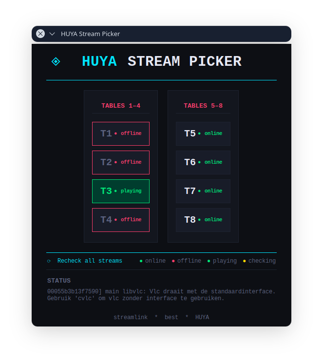

# HUYA Stream Picker

A desktop application for watching multiple HUYA streams simultaneously with real-time availability checking.
Tested on Archlinux only



## Features

- **Multi-Stream Support**: Watch up to 8 streams at the same time
- **Availability Checking**: Automatically checks if streams are online/offline
- **Real-time Status**: Color-coded indicators show stream status (online, offline, checking, playing)
- **Easy Controls**: Click to start a stream, click again to stop it
- **Modern UI**: Dark-themed interface with intuitive layout organized by table groups
- **Cross-Platform**: Works on Windows, Linux, and macOS

## Requirements

### Python 3 with tkinter

**Windows:**
- tkinter is included by default in Python 3

**Arch Linux:**
```bash
sudo pacman -S tk
```

**Debian/Ubuntu:**
```bash
sudo apt install python3-tk
```

**Fedora:**
```bash
sudo dnf install python3-tkinter
```

**openSUSE:**
```bash
sudo zypper install python3-tk
```

### Streamlink

**Windows:**
```bash
pip install streamlink
```

**Arch Linux:**
```bash
sudo pacman -S streamlink
```

**Debian/Ubuntu:**
```bash
pip install streamlink
# or
sudo apt install streamlink
```

**Fedora:**
```bash
sudo dnf install streamlink
```

**openSUSE:**
```bash
pip install streamlink
```

**Any Distribution:**
```bash
pip install --user streamlink
```

## Installation

1. Clone or download this repository
2. Install the required dependencies (see above)
3. Run the application

## Usage

### Linux/macOS:
```bash
python3 stream_picker.py
```

### Windows:
```bash
python stream_picker.py
```

## How to Use

1. **Launch the application** — the app will automatically check all stream availability on startup
2. **Click a table button** — starts streaming that table
3. **Click again** — stops the stream
4. **Multiple streams** — can run simultaneously
5. **Recheck streams** — click "⟳ Recheck all streams" to refresh availability
6. **Status indicators**:
   - 🟢 **Green dot** = Stream is online
   - 🔴 **Red dot** = Stream is offline
   - 🟡 **Yellow dot** = Checking availability
   - 🟢 **Bright green** = Currently playing

## Windows Setup Instructions

If you're new to Python on Windows:

1. Install Python 3 from [https://www.python.org/downloads/](https://www.python.org/downloads/)
   - **Important**: Check "Add Python to PATH" during installation
2. Open Command Prompt (cmd.exe) or PowerShell
3. Install streamlink:
   ```
   pip install streamlink
   ```
4. Navigate to the folder where `stream_picker.py` is located
5. Run:
   ```
   python stream_picker.py
   ```

## Streams

The application monitors and manages 8 HUYA streams organized into two groups:

**Tables 1–4**
- T1, T2, T3, T4

**Tables 5–8**
- T5, T6, T7, T8

To modify the streams, edit the `STREAMS` list in `stream_picker.py`.

## Customization

You can customize the application by editing the Python file:

- **Add/remove streams**: Modify the `STREAMS` list
- **Change colors**: Edit the color constants (e.g., `ACCENT`, `BG`, `TEXT`)
- **Adjust fonts**: Modify the `FONT_*` constants
- **Change UI layout**: Edit the `_build_ui()` method

## Troubleshooting

**"No module named tkinter":**
- Install tkinter using your system package manager (see Requirements section)

**"streamlink: command not found":**
- Install streamlink with `pip install streamlink`

**Streams won't start:**
- Ensure streamlink is properly installed
- Check your internet connection
- Verify the stream URLs in the `STREAMS` list

## License

This project is provided as-is for personal use.

## Credits

Built with Python, tkinter, and streamlink.
